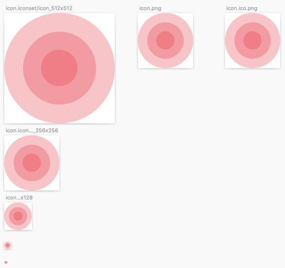

# Electron App Icons Sketch Template

> Sketch Template for quickly generating Electron app icons

## Usage

1. Change the “Icon” symbol on the “Symbols” page.
2. Select all Artboards on the page "App Icons", and export
3. Navigate to the folder you exported to using Terminal.app
4. Create an icns file using the command: `iconutil -c icns icon.iconset`
5. Create an ico file using ImageMagick: `convert icon.ico.png icon.ico`
   This step might require you to install ImageMagick. This can be done with
   Homebrew: `brew install imagemagick`

## License

[ISC](LICENSE)
